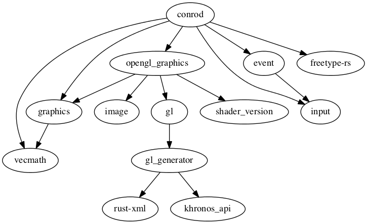

# Conrod [](https://travis-ci.org/PistonDevelopers/conrod) [](https://crates.io/crates/conrod) [](https://github.com/PistonDevelopers/conrod/blob/master/LICENSE)

An easy-to-use, 2D GUI library written entirely in Rust.

Here's a [youtube demo](https://www.youtube.com/watch?v=n2UrjogA0j0) of the [all_widgets.rs example](https://github.com/PistonDevelopers/conrod/blob/master/examples/all_widgets.rs).

Here's [another demo](https://www.youtube.com/watch?v=_ZXLCVibI8c) of it being used to create a basic synth editor.

You can find the API documentation [here](http://docs.piston.rs/conrod/conrod/).


Screenshots
-----------

The [all_widgets.rs example](https://github.com/PistonDevelopers/conrod/blob/master/examples/all_widgets.rs).


The [canvas.rs example](https://github.com/PistonDevelopers/conrod/blob/master/examples/canvas.rs).


If you have an awesome looking GUI made with conrod, please send us a screenshot and we'll add it here :)


Current State
-------------

We're just starting to reach a stable-ish API pattern! There will still be some large changes however these are more likely to be new features than API overhauls.

To get a clearer idea of where we're at see the [issues](https://github.com/PistonDevelopers/conrod/issues) and in particular, the [1.0.0 milestone](https://github.com/PistonDevelopers/conrod/milestones/1.0.0).


Features
--------

- "Reactive"/"Immediate" style - produce the UI *from your application state* in one place, rather than as a separate entity spread across callbacks, instantiation, updates and drawing.
- A simple [`Widget` trait](http://docs.piston.rs/conrod/conrod/trait.Widget.html) to allow for custom, third-party widgets.
- Opt-in, generalised, easy-to-use scrolling! I.e. simply call `.vertical_scrolling(true)` on a widget and it will become a scrollable container for its children.
- Powerful [layout and positioning](http://docs.piston.rs/conrod/conrod/trait.Positionable.html):
    - Placement - `.middle()`, `.top_left_of(CANVAS)`, etc.
    - Alignment - `.align_left()`, `.align_top_of(LABEL)`, etc.
    - Relative - `.down(20.0)`, `.right_from(BUTTON, 40.0)`, `.relative_xy(20.0, 42.0)`, etc.
    - Absolute - `.xy(6.0, 7.0)`
    - Draggable pop-up / floating canvasses - `.floating(true)`.
    - [WidgetMatrix](http://docs.piston.rs/conrod/conrod/struct.WidgetMatrix.html) and [PositionMatrix](http://docs.piston.rs/conrod/conrod/struct.PositionMatrix.html) for instantiating a grid of widgets. 
- Serializable [`Theme`](http://docs.piston.rs/conrod/conrod/theme/struct.Theme.html)s for unique style and layout defaults.
- [`widget_ids!` macro](http://docs.piston.rs/conrod/conrod/macro.widget_ids!.html) for easily and safely generating unique widget identifiers.
- Generic over events and graphics backends - compatible with glutin, sdl2, glium, gfx, opengl.
- Comes with a collection of pre-made widgets.


Available Widgets
-----------------

- [Button](http://docs.piston.rs/conrod/conrod/struct.Button.html)
- [Canvas](http://docs.piston.rs/conrod/conrod/struct.Canvas.html) (Can be positioned manually or by using the [Split](http://docs.piston.rs/conrod/conrod/struct.Split.html) or [Tabs](http://docs.piston.rs/conrod/conrod/struct.Tabs.html) wrappers for auto-layout)
- [DropDownList](http://docs.piston.rs/conrod/conrod/struct.DropDownList.html)
- [EnvelopeEditor](http://docs.piston.rs/conrod/conrod/struct.EnvelopeEditor.html)
- [Label](http://docs.piston.rs/conrod/conrod/struct.Label.html)
- [NumberDialer](http://docs.piston.rs/conrod/conrod/struct.NumberDialer.html)
- [Slider](http://docs.piston.rs/conrod/conrod/struct.Slider.html)
- [TextBox](http://docs.piston.rs/conrod/conrod/struct.TextBox.html)
- [Toggle](http://docs.piston.rs/conrod/conrod/struct.Toggle.html)
- [XYPad](http://docs.piston.rs/conrod/conrod/struct.XYPad.html)
- Custom: Conrod also provides a [Widget trait](http://docs.piston.rs/conrod/conrod/trait.Widget.html) for designing and implementing custom widgets. You can find an annotated demonstration of designing a custom widget implementation [here](https://github.com/PistonDevelopers/conrod/blob/master/examples/custom_widget.rs). All [internal widgets](https://github.com/PistonDevelopers/conrod/blob/master/src/widget) also use this same trait so they should make for decent examples. If you feel like your widget is useful enough to be included within the internal widget library, feel free to add them in a pull request :)

**To-do:**
- [Menu Bar / Tool Bar](https://github.com/PistonDevelopers/conrod/issues/417)
- [Right-click Context Menu](https://github.com/PistonDevelopers/conrod/issues/394)
- [Text Area](https://github.com/PistonDevelopers/conrod/issues/62)
- [Graph / Chart](https://github.com/PistonDevelopers/conrod/issues/84)
- [File/Directory Navigator](https://github.com/PistonDevelopers/conrod/issues/381)
- [Advanced graph visualisation and control](https://github.com/PistonDevelopers/mush)

If conrod is missing anything you really wish it had, let us know with an issue describing the widget's style, behaviour and functionality - or even better, submit a pull request :D

Make sure you check the [`widget` label](https://github.com/PistonDevelopers/conrod/labels/widget) for your desired widget first as it may have already been requested.


Getting Started
---------------

[Get freetype](http://www.freetype.org/download.html) - at the moment, Conrod uses [freetype-rs](https://github.com/PistonDevelopers/freetype-rs) for its font rendering, which means you'll need to have the freetype library installed on your system. You can [download and install the freetype library here](http://www.freetype.org/download.html).


Build the conrod lib like this:

```
git clone https://github.com/PistonDevelopers/conrod.git
cd conrod
cargo build
```

And then build and run the examples like this:

```
cargo run --release --example all_widgets
cargo run --release --example canvas
```

You can add it to your project by adding this to your Cargo.toml:

```toml
[dependencies]
conrod = "*"
```


Dependency Graph
----------------




Conrod uses Elmesque
--------------------

Conrod uses [Elmesque](https://github.com/mitchmindtree/elmesque) under the hood for its 2D
graphics and layout. You don't need to know about Elmesque to use Conrod. But if you want to
combine Conrod with your own custom Elmesque drawing, see [the example](https://github.com/PistonDevelopers/conrod/blob/master/examples/elmesque.rs).


Contributing
------------

Want to help out? See [Piston's how to contribute guide](https://github.com/PistonDevelopers/piston/blob/master/CONTRIBUTING.md).


License
-------

[MIT](https://github.com/PistonDevelopers/conrod/blob/master/LICENSE).

[Example assets](https://github.com/PistonDevelopers/conrod/issues/319).

